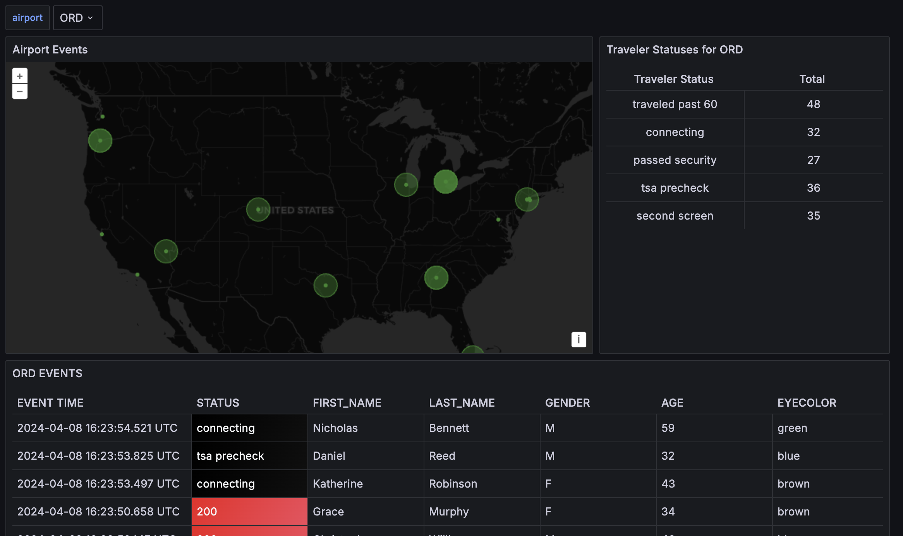
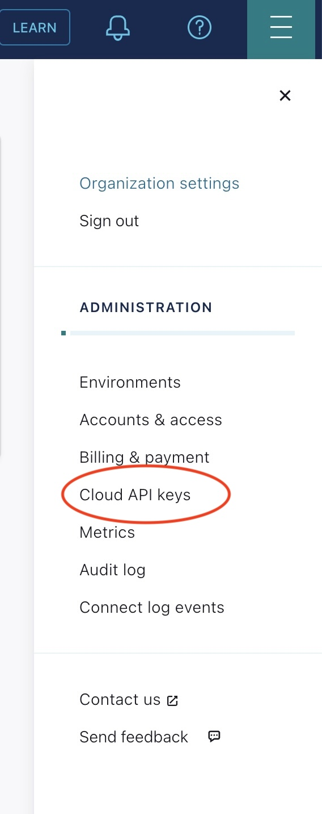
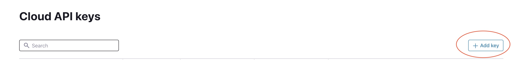
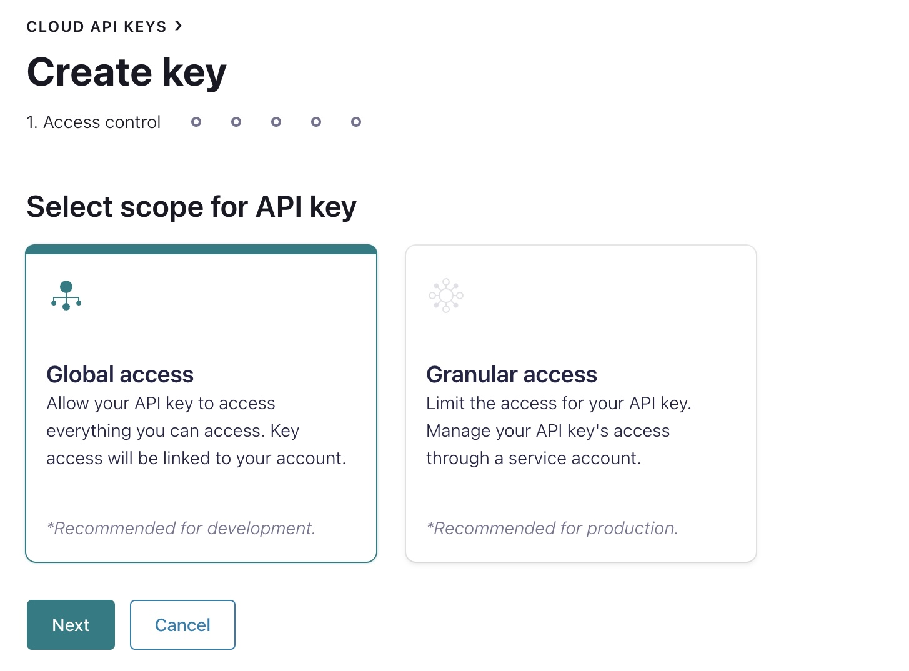
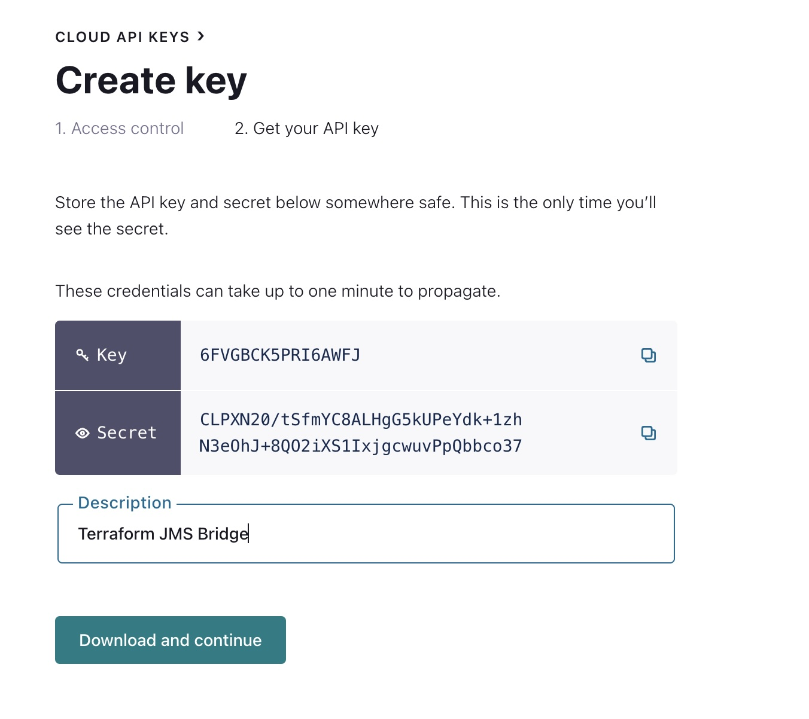
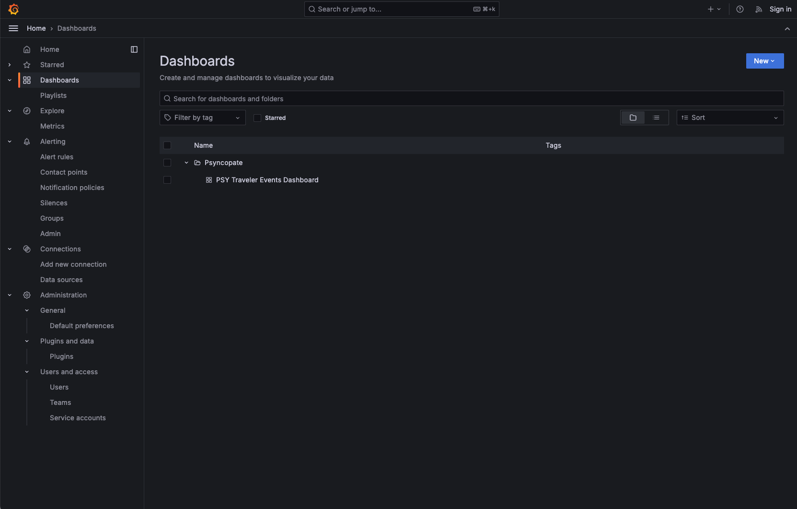

## JMS Bridge Grafana Demo

### Overview
The JMS-Bridge is a component that can be used to facilitate quicker migration from legacy JMS based systems to ones built around the Confluent Platform:
<br >[https://www.confluent.io/confluent-accelerators/](https://www.confluent.io/confluent-accelerators/)
<br />(See **JMS 2.0 Bridge** section)

This JMS Bridge Grafana Demo runs the JMS Bridge in a Docker Compose along with Confluent Cloud, Grafana with the KSQL plugin , and includes a use case for geographical visual of airport traveler events in a Grafana Dashboard.


### The JMS Bridge Grafana Demo includes the following components:

- **Confluent Cloud**: A fully managed Apache Kafka service.
- **JMS Bridge**: A component that can be used to facilitate quicker migration from legacy JMS based systems to ones built around the Confluent Platform.
- **Grafana**: A multi-platform open-source analytics and interactive visualization web application.
- **KSQL Plugin for Grafana**: A Grafana plugin that allows you to query and visualize data from Confluent Cloud using KSQL.

### Installation - Prerequisites

To run this demo, you need to have the following installed on your machine:

* Docker
* Confluent Cloud Account

### Installation 
1) Log into [Confluent Cloud](https://confluent.cloud) and enter your email and password. If you are not registered before, [click here][https://www.confluent.io/confluent-cloud/tryfree/] to register.


2) Once you have logged in, click on the menu icon at the upper right hand corner and click **Cloud API Keys** to create Cloud API Keys for the terraform provider. 

<div align="center" padding=25px>
    
</div>

3) Click **+ Add Key** to create a new API Key.

<div align="center" padding=25px>
    
</div>

4) For the purpose of this demo selet **Global Access** and click **Next**

<div align="center" padding=25px>
    
</div>

5) Type a description and to preserve the keys, click download. 

<div align="center" padding=25px>
    
</div>

6) Create a file called `values.tfvars` with the following content in the same directory as `docker-compose.yml`:
```shell
confluent_cloud_api_key="<confluent_cloud_api_key>"
confluent_cloud_api_secret="<confluent_cloud_api_secret>"
confluent_cloud_provider="<confluent_cloud_provider[AWS|GCP|AZURE]>"
confluent_cloud_region="<confluent_cloud_region>"
confluent_cloud_environment_name="<confluent_cloud_environment_name>"
confluent_cloud_cluster_name="<confluent_cloud_cluster_name>"
```

7)  run the following command to deploy the JMS Bridge Grafana Demo
```shell
cd jms-bridge-grafana-demo
./deploy.sh
```

### Usage

To produce messages, run the following command:
```shell
cd jms-bridge-grafana-demo
./produce.sh
```

Now you can access the Grafana Dashboard by visiting [http://localhost:3000](http://localhost:3000) and select the `PSY Traveler Events Dashboard` in the Dashboards section.



### Cleanup

To stop and remove the containers, run the following command:
```shell
cd jms-bridge-grafana-demo
./destroy.sh
```
